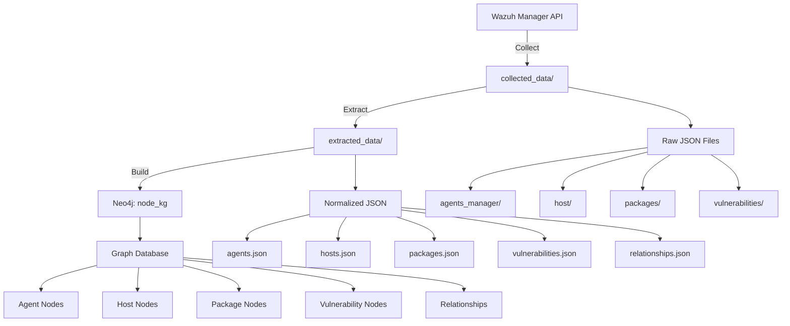

# Day 0: Node Graph Creation Guide

## Overview

This document describes how the Node Knowledge Graph (Node KG) is created on Day 0 - the initial deployment of the Wazuh agent and the first data collection cycle.

## Architecture Context

```
┌─────────────────────────────────────────────────────────────┐
│                    DataLegos Architecture                    │
├─────────────────────────────────────────────────────────────┤
│                                                               │
│  Node KG (Local Reality)          Core Graph (Strategic)    │
│  ├─ Detailed, Private             ├─ Aggregated, Public     │
│  ├─ Per-host granularity          ├─ Privacy-preserving     │
│  └─ Full audit trail              └─ Consortium-safe        │
│                                                               │
└─────────────────────────────────────────────────────────────┘
```

## Day 0 Pipeline

### Phase 1: Data Collection
**Script:** `scripts/main.py`

```bash
python scripts/main.py
```

**What Happens:**
1. Connects to Wazuh Manager API
2. Discovers all registered agents
3. Collects data from each agent:
   - Host/OS information (syscollector)
   - Installed packages (syscollector)
   - Hardware details (syscollector)
   - File Integrity Monitoring (FIM)
   - Vulnerabilities (from indexer)
   - Agent groups and configuration

**Output:** `collected_data/{timestamp}/`
```
collected_data/20260210_201344/
├── agents_manager/
│   └── All_Agents.json
├── host/
│   ├── agent_000/Syscollector_OS_Info_000.json
│   ├── agent_001/Syscollector_OS_Info_001.json
│   └── ...
├── packages/
│   ├── agent_000/Syscollector_Packages_000.json
│   └── ...
├── hardware/
│   ├── agent_000/Syscollector_Hardware_000.json
│   └── ...
├── fim/
│   ├── agent_000/File_Integrity_Monitoring_000.json
│   └── ...
├── vulnerabilities/
│   ├── agent_000/Vulnerabilities_000.json
│   └── ...
└── groups/
    └── Groups_List.json
```

**Configuration:** `config/paths_config.yaml`

---

### Phase 2: Data Extraction & Normalization
**Script:** `scripts/extract_data.py`

```bash
python scripts/extract_data.py
```

**What Happens:**
1. Reads collected JSON files
2. Normalizes data into graph-ready format
3. Creates nodes and relationships
4. Validates data integrity

**Output:** `extracted_data/{timestamp}/`
```
extracted_data/20260210_201344/
├── agents.json              # Agent nodes
├── hosts.json               # Host/OS nodes
├── packages.json            # Software package nodes
├── hardware.json            # Hardware component nodes
├── vulnerabilities.json     # Vulnerability nodes
├── groups.json              # Agent group nodes
└── relationships.json       # All relationships
```

**Node Types Created:**
- `Agent` - Wazuh agents
- `Host` - Operating systems
- `Package` - Installed software
- `Hardware` - Physical/virtual hardware
- `Vulnerability` - CVEs and security issues
- `Group` - Agent groupings

**Relationship Types:**
- `RUNS_ON` - Agent → Host
- `HAS_PACKAGE` - Host → Package
- `HAS_HARDWARE` - Host → Hardware
- `HAS_VULNERABILITY` - Package → Vulnerability
- `BELONGS_TO` - Agent → Group

---

### Phase 3: Node Graph Building
**Script:** `scripts/build_node_graph.py`

```bash
python scripts/build_node_graph.py
```

**What Happens:**
1. Connects to Neo4j database (node_kg)
2. Creates indexes for performance
3. Loads nodes with MERGE (idempotent)
4. Creates relationships
5. Validates graph structure

**Output:** Neo4j database `node_kg`

**Graph Schema:**
```cypher
// Nodes
(:Agent {id, name, ip, status, version, os_platform})
(:Host {id, hostname, os_name, os_version, architecture})
(:Package {id, name, version, vendor, architecture})
(:Hardware {id, type, model, cores, ram_total})
(:Vulnerability {cve, title, severity, cvss_score, published_date})
(:Group {id, name, count})

// Relationships
(Agent)-[:RUNS_ON]->(Host)
(Host)-[:HAS_PACKAGE]->(Package)
(Host)-[:HAS_HARDWARE]->(Hardware)
(Package)-[:HAS_VULNERABILITY]->(Vulnerability)
(Agent)-[:BELONGS_TO]->(Group)
```

**Configuration:** `config/neo4j_config.yaml`, `config/graph_config.yaml`

---

## Complete Day 0 Workflow

### Quick Start (All Phases)
```bash
# Phase 1: Collect data from Wazuh
python scripts/main.py

# Phase 2: Extract and normalize
python scripts/extract_data.py

# Phase 3: Build Node Graph
python scripts/build_node_graph.py
```

### Verify Node Graph
```cypher
// Connect to Neo4j and run:

// Count nodes by type
MATCH (n) RETURN labels(n)[0] as NodeType, count(n) as Count

// View sample agent with relationships
MATCH (a:Agent)-[r]->(n)
WHERE a.id = '000'
RETURN a, r, n
LIMIT 50

// Check vulnerability distribution
MATCH (v:Vulnerability)
RETURN v.severity, count(v) as Count
ORDER BY Count DESC
```

---

## Data Flow Diagram



---

## Node Graph Characteristics

### Local Reality (Detailed)
- ✅ **Full granularity**: Every package, every CVE, every host detail
- ✅ **Private data**: Hostnames, IP addresses, specific configurations
- ✅ **Audit trail**: Complete history of what's installed where
- ✅ **Queryable**: Rich Cypher queries for investigations

### Example Queries

**Find all critical vulnerabilities:**
```cypher
MATCH (h:Host)-[:HAS_PACKAGE]->(p:Package)-[:HAS_VULNERABILITY]->(v:Vulnerability)
WHERE v.severity = 'Critical'
RETURN h.hostname, p.name, p.version, v.cve, v.cvss_score
ORDER BY v.cvss_score DESC
```

**Find hosts with specific software:**
```cypher
MATCH (h:Host)-[:HAS_PACKAGE]->(p:Package)
WHERE p.name CONTAINS 'openssl'
RETURN h.hostname, p.name, p.version
```

**Agent vulnerability summary:**
```cypher
MATCH (a:Agent)-[:RUNS_ON]->(h:Host)-[:HAS_PACKAGE]->(p:Package)-[:HAS_VULNERABILITY]->(v:Vulnerability)
RETURN a.name, 
       count(DISTINCT v) as total_vulns,
       count(DISTINCT CASE WHEN v.severity = 'Critical' THEN v END) as critical,
       count(DISTINCT CASE WHEN v.severity = 'High' THEN v END) as high
ORDER BY critical DESC, high DESC
```

---

## Configuration Files

### `config/neo4j_config.yaml`
```yaml
neo4j:
  uri: "bolt://localhost:7687"
  username: "neo4j"
  password: "your_password"
  database: "node_kg"  # Node Knowledge Graph database
```

### `config/graph_config.yaml`
```yaml
graph:
  node_types:
    - Agent
    - Host
    - Package
    - Hardware
    - Vulnerability
    - Group
  
  relationship_types:
    - RUNS_ON
    - HAS_PACKAGE
    - HAS_HARDWARE
    - HAS_VULNERABILITY
    - BELONGS_TO
  
  indexes:
    - Agent.id
    - Host.id
    - Package.id
    - Vulnerability.cve
    - Group.id
```

### `config/paths_config.yaml`
```yaml
paths:
  base_directory: "collected_data/20260210_201344"
  output_directory: "extracted_data"
  log_directory: "logs"
```

---

## Troubleshooting

### Issue: No data collected
**Solution:**
- Check Wazuh Manager API connectivity
- Verify credentials in environment variables
- Check `logs/` for error messages

### Issue: Extraction fails
**Solution:**
- Verify collected data exists in `collected_data/`
- Check JSON file format validity
- Review `logs/extract_data.log`

### Issue: Graph build fails
**Solution:**
- Verify Neo4j is running: `docker ps` or check Neo4j Desktop
- Test connection: `cypher-shell -u neo4j -p password`
- Check database name in config matches Neo4j
- Review `logs/build_node_graph.log`

### Issue: Duplicate nodes
**Solution:**
- Node graph uses MERGE (idempotent)
- Re-running is safe and will update existing nodes
- Use `MATCH (n) DETACH DELETE n` to clear and rebuild

---

## Performance Considerations

### Data Volume
- **Small deployment** (1-10 agents): < 1 minute total
- **Medium deployment** (10-100 agents): 2-5 minutes total
- **Large deployment** (100+ agents): 10-30 minutes total

### Neo4j Optimization
```cypher
// Create indexes for faster queries
CREATE INDEX agent_id IF NOT EXISTS FOR (a:Agent) ON (a.id);
CREATE INDEX host_id IF NOT EXISTS FOR (h:Host) ON (h.id);
CREATE INDEX package_id IF NOT EXISTS FOR (p:Package) ON (p.id);
CREATE INDEX vulnerability_cve IF NOT EXISTS FOR (v:Vulnerability) ON (v.cve);
CREATE INDEX vulnerability_severity IF NOT EXISTS FOR (v:Vulnerability) ON (v.severity);
```

---

## Next Steps

After Day 0 Node Graph creation:

1. ✅ **Verify Node Graph**
   ```cypher
   MATCH (n) RETURN labels(n)[0], count(n)
   ```

2. ➡️ **Create Aggregations** (Phase 4)
   ```bash
   python scripts/aggregate_data_v2.py
   ```

3. ➡️ **Scan for PII** (Phase 4)
   ```bash
   python scripts/detect_pii.py
   ```

4. ➡️ **Build Core Graph** (Phase 5)
   ```bash
   python scripts/build_core_graph.py
   ```

---

## Summary

**Day 0 Node Graph** = Complete, detailed, private knowledge graph of your infrastructure

- 📊 **Purpose**: Local reality, full audit trail, detailed investigations
- 🔒 **Privacy**: Private, not shared outside organization
- 🎯 **Granularity**: Per-host, per-package, per-CVE detail
- 🔍 **Queryable**: Rich Cypher queries for security analysis
- 🔄 **Updatable**: Re-run pipeline to refresh data

This forms the foundation for the privacy-preserving Core Graph that will be shared with the consortium.
